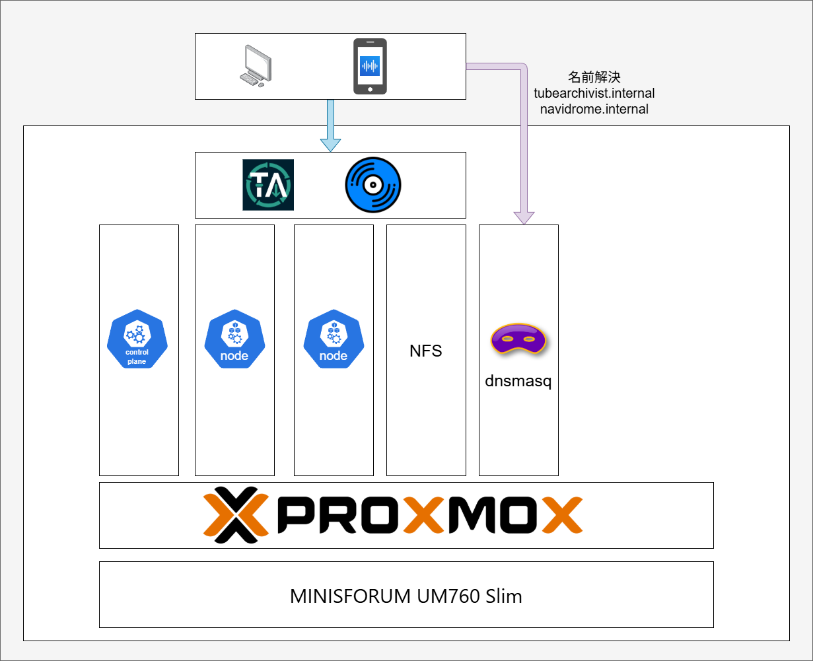

## My Home Kubernetes
Hardware
- MINISFORUM UM760 Slim(32GB RAM)

Virtualization Layer
- Proxmox VE

Infrastructure Services
- dnsmasq
- NFS
- Kubernetes
    - containerd
    - Flannel
    - Prometheus
    - Grafana
    - Loki

Applications
- [TubeArchivist](https://www.tubearchivist.com/)
- [Navidrome](https://www.navidrome.org/)
    - Mobile Client: [Substreamer](https://apps.apple.com/jp/app/substreamer/id1012991665)
- [ta2music](https://github.com/sredituo/ta2music)

